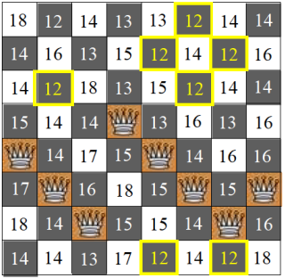

<h1 align="center">8 Queen Problem Solved using Gradient Descent Algorithm</h1>

In this project, I tackled the classic 8 Queen Problem, a puzzle where the challenge is to place eight queens on an 8x8 chessboard in a way that no two queens threaten each other. The problem is a well-known combinatorial optimization challenge with applications in various fields such as artificial intelligence, computer science, and mathematics.

<h4>Understanding the 8 Queen Problem</h4>

The 8 Queen Problem requires finding a placement for eight queens on a standard chessboard where no two queens threaten each other. A queen can attack in eight directions - horizontally, vertically, and diagonally. Therefore, placing queens in such a way that none of them attack each other is a non-trivial task.

  

<h4>Approach using Gradient Descent Algorithm</h4>

To solve the 8 Queen Problem, I employed the Gradient Descent Algorithm. Gradient Descent is a first-order iterative optimization algorithm used for finding the local minimum of a function. It's particularly useful in finding the minimum of a function that is differentiable and continuous.

  

 
Let's break down how it works specifically for this problem:

<b>Objective Function:</b> The algorithm starts with an objective function that we aim to minimize. In the context of the 8 Queen Problem, our objective function is the number of conflicts between queens on the chessboard. The lower the number of conflicts, the better the solution.

<b>Initialization:</b> We start by initializing the parameters of our optimization problem. In the case of the 8 Queen Problem, this involves randomly placing queens on the chessboard. This is done by the <em>generate_random_queens</em> method.

<b>Evaluation:</b> The <em>evalboard</em> method evaluates the fitness of the current solution by counting the number of conflicts between queens. It checks for conflicts in horizontal, vertical, and diagonal directions.

<b>Gradient Descent Iteration</b>

<ul>
  <li>The <em>gradient_descent</em> method initializes the queens' positions randomly and then iterates to minimize the number of conflicts.</li>
  <li>At each iteration, it evaluates the fitness for each possible move of a queen in a column using the <em>evalsquares</em> method. This calculates the fitness for moving a queen to each square in the column.</li>
  <li>It then selects the square with the minimum fitness value, indicating the move that reduces conflicts the most.</li>
  <li>The selected square becomes the new position for the queen in that column.</li>
  <li>This process repeats until either a solution with no conflicts is found or a maximum number of iterations is reached.</li>
</ul>

<b>Termination:</b> The algorithm terminates when either a solution with no conflicts is found or a maximum number of iterations (25 in this case) is reached.

The key idea behind using Gradient Descent for the 8 Queen Problem is to iteratively improve the solution by minimizing the number of conflicts between queens. By evaluating the fitness of potential moves and selecting the one that reduces conflicts the most, the algorithm gradually converges towards a solution where no two queens threaten each other.

